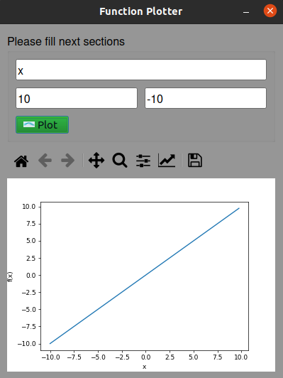

## Function Plotter
A Cross platform desktop tool for plotting fucntions 

# Description
GUI application takes a string from user which has sequence of variable, operators and operands and takes minimum value and maximum value then pass it through some checking errors, if it passes it, graph will be plotted in the same GUI

# Dependencies 
1. [PySide2](https://pypi.org/project/PySide2/)
   - To install it use following command
   ```
   pip3 install Pyside2
   ```
2. [Matplotlib](https://matplotlib.org/)
   - To install it use following command
   ```
   pip3 install matplotlib
   ```
3. [Numpy](https://numpy.org/)
   - To install it use following command
   ```
   pip3 install numpy
   ```
- There's deployment for **Linux OS** in this [Link](https://drive.google.com/file/d/13dX_gteDYf-vUeSocbVrP-D-xBRB0O6O/view?usp=sharing)
- We used [PyInstaller](https://www.pyinstaller.org/) for deploying which is compatible with numpy, matplotlib and PySide
- You can deploy the project on your OS, but it's just working with 2.1.x or less version of matplotlib
  ```
  pyinstaller GUI_main.py --onefile --icon="icon.png"
  ```

- You can use the application withought downloading the deployment, just follow next steps
  * clone the repository in your local disk
  * open terminal in same directory which the repository has been downloaded
  * write in terminal this command
  ```
  python3 GUI_main.py
  ```

# Supported equations
- the application supports the basics operation multiplication `*`, division `/`, addition `+`, subtraction `-` and power `^`
- the application supports any depth of parentheses
- the application doesn't support checking math as complex numbers: 
- the application supports any range input to plot the function if the function is defined in the given range
- the application plots the function in the given range with step equal to 0.25 for some accuracy and speedup run time
- the application works with any **string** variable name 
- the application works according to operators high precedence in math 
- the application works independent of spaces in the equation
- the application doesn't check strange operators or characters

# Code pipeline
The implementation of the application mainly is based on 2 algorithms
1. Graphical user interface code or design
2. Logic code for processing the equation

The implemntation is designed so it can be easly add other operations or complex equation

After filling the inputs in GUI and click **Plot** button, some checking error will be applied in the following sequence
  1. check if the equation section is empty
  2. check if there is wrong variable name or multiple variable names
  3. check if the maximum value section is empty
  4. check if the maximum value is valid number, not string or anything else
  5. check if the minimum value section is empty
  6. check if the minimum value is valid number, not string or anything else
  7. check if the maximum value is greater than minimum value, not less than or equal

If the inputs of the GUI are passed all of this checkings, the application will try a sample or test case to check if the equation has valid sequence of operators and operands
- try to solve the equation with the maximum value
  - check if there's invalid sequence of parentheses
  - check if there's invalid sequence of operators
  - check if there's invalid sequence of operands
  - check if the operators and operands aren't matching

It was the final check, if the equation passed it, the graph will be plotted in the same GUI

The graph is plotted using **Matplotlib**, so we can get use of its toolbar in our application

# Example of GUI:
